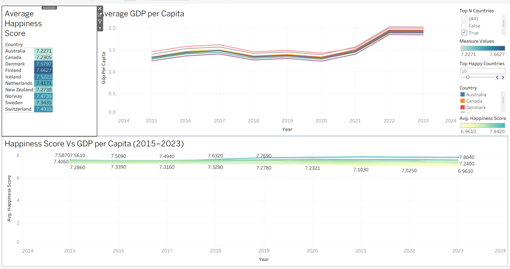

🌍 World Happiness Analysis
📊 Project Description

This project analyzes happiness levels across countries using global data. It explores key factors such as income, health, social support, freedom, and trust to understand what influences happiness worldwide.

🔍 Key Insights

Comparison of happiness scores across countries

Impact of economic and social factors on happiness

Identification of top and bottom ranking countries

🛠 Tools Used

Tableau

World Happiness Dataset

📸 Dashboard Screenshots

Link---> https://public.tableau.com/app/profile/binil.john/viz/WorldHappinessAnalysis_17656553759740/HappinessAnalysisStory20152023

📁 Files
.twbx – Tableau packaged workbook
README.md – Project overview
Screenshot images of dashboards
🔗 How to View

Download the .twbx file and open it using Tableau Public or Tableau Desktop

